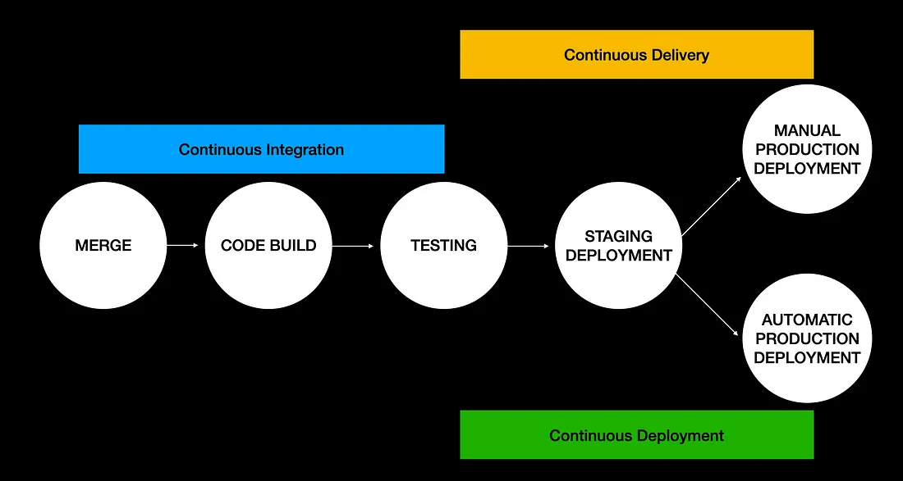
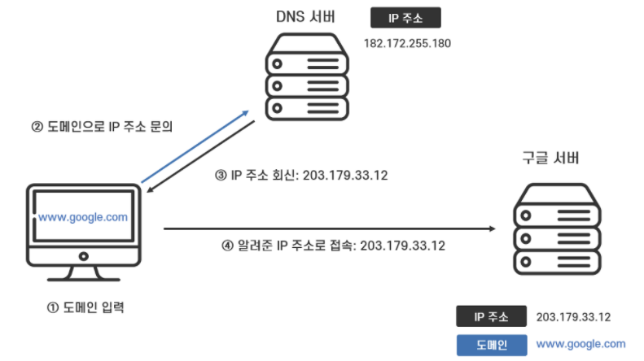
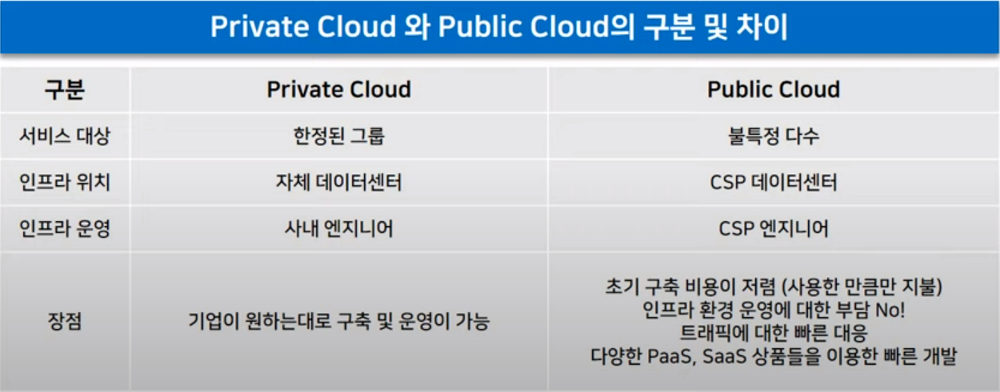

# 1주차 IT인프라

## IT 인프라

- 시스템 구조 및 체계
- IT 서비스의 기반이 되는 구성 요소들의 집합

## IT인프라 구성요소

- 하드웨어(HW)
    - 데이터 저장을 위한 스토리지, 전원장치
- 운영체제(OS)
    - 사용자가 컴퓨터를 쓸 수 있게 해주는 프로그램
- 네트워크(Network)
    - 케이블, 스위치, 라우터, 네트워킹, 보안방화벽, 인터넷 통신
- 미들웨어(Middleware)
    - 운영체제와 비즈니스를 처리하는 애플리케이션의 중간에서 도움을 주는 소프트웨어
    - Web Server: 클라언트 요청을 받아 웹 페이지 응답해주는 기능을 가진 서버
    - DBMS: 데이터베이스 관리 시스템

## IT인프라 유형

- 전통적인 인프라(On Premises)
    - 데이터 센터나 서버실에 서버를 직접 두고 관리하는 방식
    - 장비를 직접 사서 관리하기 때문에 초기비용이 많이 듬
    - 직접 관리 가능, 기밀성 높음
- Public Cloud 인프라/Private Cloud 인프라
    - 클라우드 프로바이더가 데이터 센터와 인프라를 보유하고 사용자에게 제공하는 형태
    - 최근 많은 기업들이 클라우드 기반 형식으로 바꾸는 중
    - 초기 투자금이 적음 (사용한만큼 값을 지불)
    - Public Cloud: 인터넷을 통해 다수에게 제공 (AWS, GCP, Azure)
    - Private Cloud: public cloud에서 이용자를 한정한 형태 (보안 높음)

## HTTPS

- Hypertext Transfer Protocol Secure
- 웹 브라우징에 사용되는 통신 프로토콜
- 데이터 통신이 암호화된 HTTP의 보안버전
    - HTTPS는 SSL(보안 소켓 계층) 또는 TLS(전송 계층 보안) 프로토콜을 사용하여 제3자가 데이터를 엿보거나 조작하는 것을 방지

## DNS서버

- Domain Name System Server
- 사람이 읽을 수 있는 도메인 이름을 IP주소로 변환시켜주는 시스템
- 사용자가 URL 입력하거나 링크를 클릭할 때 장치와 컴퓨터가 올바른 웹사이트나 서비스를 찾을 수 있도록 도와주는 인터넷 전화 번호부 역할

## DNS서버 구성요소

- 도메인 네임 스페이스(Domain Name Space)
    - DNS가 저장 관리하는 계층적 구조
    - 도메인 이름 저장을 분산
- 네임 서버(Name Server)
    - 권한 있는 DNS서버
    - 해당 도메인 이름의 IP주소 찾음
- 리졸버(Resolver)
    - 권한 없는 DNS서버
    - DNS 클라이너트 요청을 네임 서버로 전달하고 찾은 정보를 클라이언트에게 제공

## DNS서버 작동 과정

1. 웹 브라우저에 도메인 이름 입력
2. 해당 IP주소를 DNS서버에 요청
3. 데이터베이스 검색 및 다른 DNS서버에 연결하여 도메인 이름과 연결된 IP주소 찾음
4. IP주소 찾으면 컴퓨터로 반환되어 요청된 웹사이트 또는 서비스에 연결

DNS서버의 중요성

- DNS서버가 없으면 방문하려는 모든 웹사이트에 대한 IP주소를 일일이 기억해야함 (예시: 172.16.254.1)

## CI/CD

- 소프트웨어 개발 및 배포 프로세스를 효율적으로 관리하기 위한 방법론
- Continuous Integration (지속적 통합)
    - 소프트웨어 개발 중에 코드 변경 사항을 지속적으로 통합하는 접근 방식
    - 여러 개발자가 동시에 작업하는 경우, 코드 변경이 발생할 때마다 자동으로 빌드 및 테스트를 수행하여 통합 오류를 최소화
    - CI는 빠른 피드백 제공으로 개발자들이 빠르게 오류를 발견하고 수정할 수 있도록 도와줌
- Continuous Delivery (지속적 제공)
    - CI를 통과한 코드는 자동으로 테스트 및 스테이징 환경까지 배포될 수 있게 되지만, 실제 운영 환경에는 수동으로 배포해야 한다.
    - 개발자들이 안정적인 버전을 배포할 수 있게 해줌
    - 목표: 프로덕션 환경으로 배포할 준비가 되어 있는 코드베이스 확보하는 것
- Continuous Deployment (지속적 배포)
    - CI/CD의 마지막 단계
    - Continuous Delivery의 확장된 형태로 애플리케이션 프로덕션을 릴리스하는 작업을 자동화 시켜서 수동 배포로 생기는 프로세스 과부하 해결
